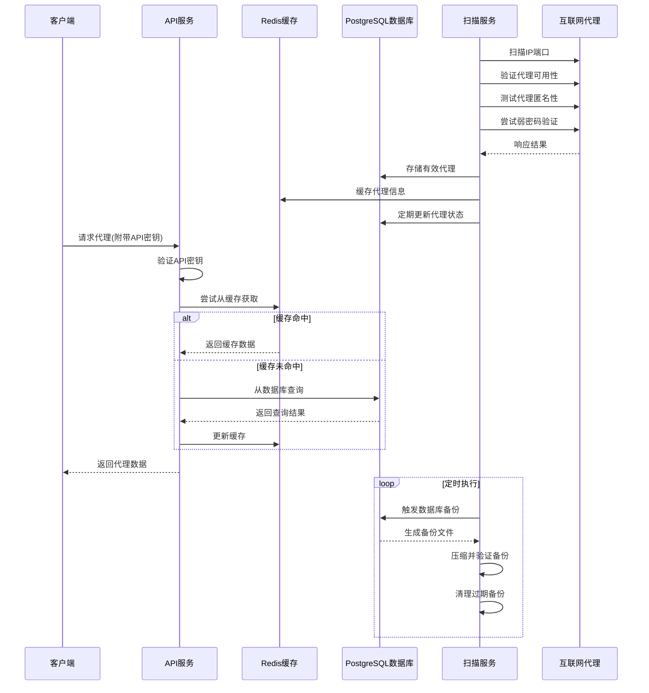

# 代理IP扫描器架构图

以下是代理IP扫描器系统的架构流程图，展示了各个组件间的关系和数据流向。

## 系统架构图

```mermaid
graph TD
    classDef component fill:#f9f,stroke:#333,stroke-width:2px;
    classDef database fill:#bbf,stroke:#333,stroke-width:2px;
    classDef external fill:#bfb,stroke:#333,stroke-width:2px;

    %% 外部组件
    User[用户/客户端] :::external
    Internet[互联网代理服务器] :::external
    
    %% 主要服务
    Scanner[扫描服务] :::component
    API[API服务] :::component
    
    %% 数据库和缓存
    PostgreSQL[(PostgreSQL数据库)] :::database
    Redis[(Redis缓存)] :::database
    Backups[(备份存储)] :::database
    
    %% 扫描器子组件
    IPGenerator[IP生成器]
    PortScanner[端口扫描器]
    ProxyChecker[代理检查器]
    PasswordTester[弱密码测试器]
    
    %% 关系连接
    User -->|请求代理| API
    API -->|返回代理| User
    API -->|读取代理数据| PostgreSQL
    API -->|读取缓存| Redis
    
    Internet -.->|扫描连接| Scanner
    Scanner -->|存储代理| PostgreSQL
    Scanner -->|缓存代理| Redis
    Scanner -->|备份数据| Backups
    
    Scanner -->|包含| IPGenerator
    Scanner -->|包含| PortScanner
    Scanner -->|包含| ProxyChecker
    Scanner -->|包含| PasswordTester
    
    IPGenerator -->|目标IP| PortScanner
    PortScanner -->|开放端口| ProxyChecker
    ProxyChecker -->|验证代理| ProxyChecker
    ProxyChecker -->|需认证代理| PasswordTester
    PasswordTester -->|认证结果| ProxyChecker
    
    %% 数据流
    PostgreSQL -.->|数据备份| Backups
```

## 系统工作流程



## 部署架构图

```mermaid
graph TB
    classDef container fill:#e9e,stroke:#333,stroke-width:2px;
    classDef volume fill:#ccf,stroke:#333,stroke-width:2px;
    classDef network fill:#cfc,stroke:#333,stroke-width:2px;
    
    %% Docker容器
    APIContainer[API容器] :::container
    ScannerContainer[扫描器容器] :::container
    PostgresContainer[PostgreSQL容器] :::container
    RedisContainer[Redis容器] :::container
    
    %% 数据卷
    PostgresVolume[PostgreSQL数据卷] :::volume
    RedisVolume[Redis数据卷] :::volume
    BackupVolume[备份数据卷] :::volume
    LogVolume[日志数据卷] :::volume
    
    %% 网络
    DockerNetwork[Docker网络] :::network
    
    %% 关系
    PostgresContainer --- PostgresVolume
    RedisContainer --- RedisVolume
    
    APIContainer --- LogVolume
    ScannerContainer --- LogVolume
    
    APIContainer --- BackupVolume
    ScannerContainer --- BackupVolume
    
    DockerNetwork --- APIContainer
    DockerNetwork --- ScannerContainer
    DockerNetwork --- PostgresContainer
    DockerNetwork --- RedisContainer
    
    %% 端口映射
    APIContainer -.->|5000:5000| 外部访问
```

## 组件说明

### 1. 扫描服务
- **IP生成器**：根据配置的IP段生成待扫描的IP地址
- **端口扫描器**：扫描IP的开放端口，支持Socket、Nmap和Masscan三种扫描方式
- **代理检查器**：验证发现的代理IP的可用性、匿名性和性能
- **弱密码测试器**：对需要认证的代理进行弱密码尝试

### 2. API服务
- 提供RESTful API接口
- 处理认证和请求验证
- 支持代理过滤和排序

### 3. 数据存储
- **PostgreSQL**：存储代理IP信息和扫描目标
- **Redis**：提供高性能缓存，加速常用查询
- **备份系统**：自动备份数据，定期清理过期备份

## 数据流向

1. 扫描服务从互联网发现并验证代理IP
2. 有效代理被存储到PostgreSQL数据库并缓存到Redis
3. API服务响应客户端请求，从缓存或数据库获取代理数据
4. 定期执行数据库备份，确保数据安全 